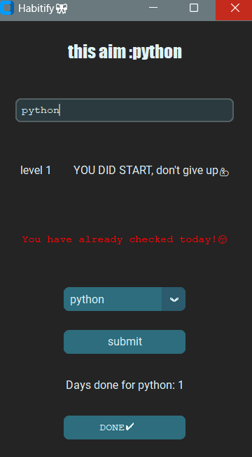

  Habitify 🎀

Habitify  is a motivational habit tracker built with Python and CustomTkinter.  
It helps you stay consistent with your daily goals using a level-based "streak system" — inspired by how seriously people treat their Duolingo streaks! 😄

Miss a single day and your streak resets to zero! 📉  
This app was born from the idea that small daily wins lead to big long-term results. 💡

---

 🧠 Concept

To stay consistent with my daily essentials like vocabulary review, I created a level-based routine:

- Level 1 : 15 minutes daily
- Level 2 : 30 minutes daily
- Level 3 :45 minutes daily

The more days you complete in a row, the higher your streak level gets.  
Fall behind? Your streak resets — but you can always start again.

---

🚀 Features

- ✅ Add and track any habit or goal
- 📅 See your current streak
- 🧠 Motivational messages based on your progress
- 💾 Streak data is saved locally in a `.json` file
- 🌙 Beautiful dark theme (customizable)
✨ More features will be available in future updates!
---
 🎨 Theme

This app uses a custom theme from [CTkThemesPack by a13xe](https://github.com/a13xe/CTkThemesPack).  
Make sure to download the desired theme (e.g., `breeze.json`) and set the correct path in `habit_tracker.py`:
```python
ctk.set_default_color_theme("path/to/breeze.json")
```

---

 📷 Screenshot
> 

---
 💾 Download

You can download the latest Windows executable from the [Releases](https://github.com/FatemehED/Habitify/releases) section.

➡️ [Download Habitify v1.0.0 (.exe)](https://github.com/FatemehED/Habitify/releases/download/v1.0.0/Habitify.exe)


💖 Built with Love

Created by  Fatemeh Ensafdoust  
Feel free to ⭐ the repo or open issues with ideas for improvements!
